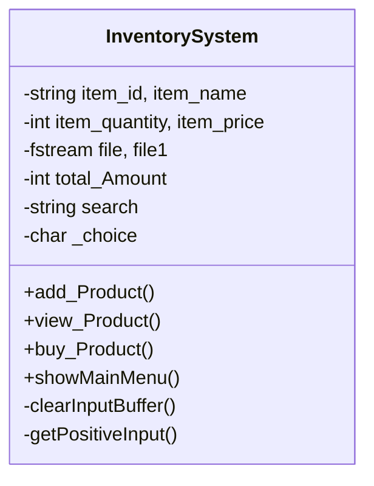

# General Store Inventory Management System

  

A console-based inventory management system built with C++ using Object-Oriented Programming principles.

## Features

- **Product Management**
  - Add new products with ID, name, quantity, and price
  - View all products in a formatted table
  - Update inventory when products are sold

- **Sales Processing**
  - Purchase multiple products in one transaction
  - Real-time inventory updates
  - Automatic receipt generation

- **Data Persistence**
  - All inventory data saved to `data.txt` file
  - Data persists between program runs

## Getting Started

### Prerequisites

- C++ compiler (g++, clang++, or MSVC)
- Standard C++ library support

### Installation

1. Clone the repository:
   ```bash
   git clone https://github.com/yourusername/general-store-inventory.git
   cd general-store-inventory
   ```

2. Compile the program:
   ```bash
   g++ main.cpp -o inventory
   ```

3. Run the program:
   ```bash
   ./inventory
   ```

## Usage

1. **Main Menu**
   ```
   ===== Inventory Management System =====
   1. Add Product
   2. View Products
   3. Buy Products
   0. Exit
   ```

2. **Adding Products**
   - Enter product details when prompted
   - Products are automatically saved to file

3. **Viewing Products**
   - Displays all products in a formatted table
   - Shows current stock levels and prices

4. **Buying Products**
   - View products first to see available items
   - Enter product ID and quantity to purchase
   - System calculates total and updates inventory

## File Structure

- `main.cpp` - Contains all source code
- `data.txt` - Auto-generated inventory database (created on first run)

## Code Structure



## Contributing

Contributions are welcome! Please follow these steps:

1. Fork the project
2. Create your feature branch (`git checkout -b feature/AmazingFeature`)
3. Commit your changes (`git commit -m 'Add some amazing feature'`)
4. Push to the branch (`git push origin feature/AmazingFeature`)
5. Open a Pull Request

## License

Distributed under the MIT License. See `LICENSE` for more information.

## Contact

Name - [Muhammad Taha](https://www.linkedin.com/in/muhammad-taha101/) - toaha155@gmail.com

Linkedin: https://www.linkedin.com/in/muhammad-taha101/
